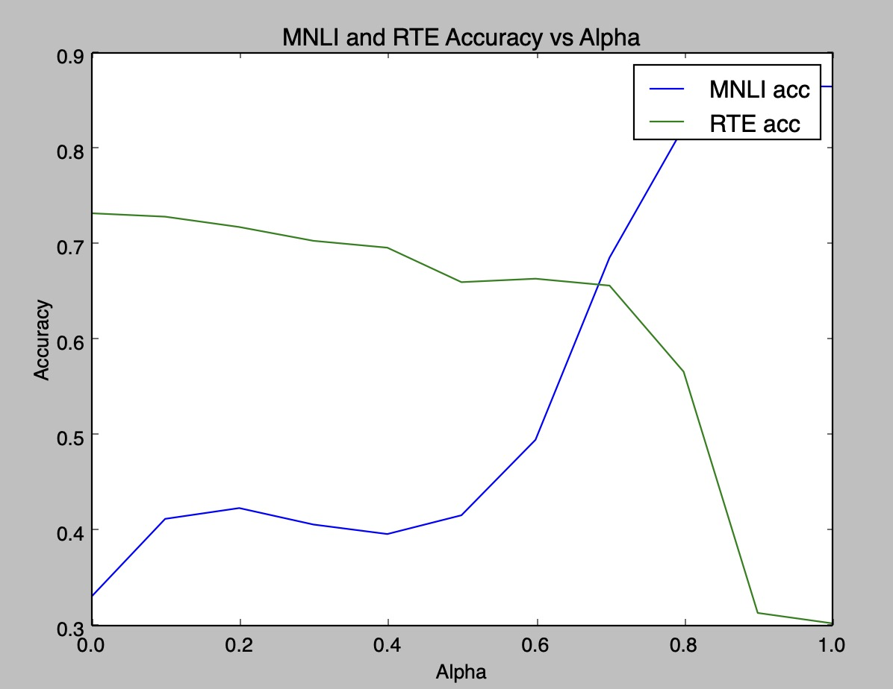

# Multi-LoRA-LLM

Multi-LoRA-LLM is a project that aims to enhance the performance of LLM (Language Model with Latent Retrieval and Alignment) by utilizing multiple LoRA (Latent Retrieval and Alignment) models. This README provides instructions on how to use and evaluate the Multi-LoRA-LLM project.

## Installation

``` bash
pip install requirements.txt
```

## Training a LoRA Model

To train a LoRA model, follow these steps:

You can download base model from HuggingFace, RoBERTa-base as an example:

``` bash
git clone https://huggingface.co/roberta-base
```

Execute train.sh or train.py in your terminal:

``` bash
bash train.sh /path/to/base_model
```

This will initiate the training process for the LoRA model.

## Evaluating the Trained LoRA Models

To evaluate the trained LoRA models, use the eval.py script with the following command:

``` bash
python eval.py --task rte --base_model /path/to/base_model --lora_model /path/to/lora_model
```

Make sure to replace /path/to/base_model with the path to the base model and /path/to/lora_model with the path to the LoRA model.

## Merging Code

The code for merging is provided in merge.py. Use this script to perform the merging process for the relevant components of the Multi-LoRA-LLM project.

## Producing Comparison Experiment



The comparison experiment can be generated using the compare_exp.py script. Run the following command:

``` bash
python compare_exp.py
```

This will generate the comparison experience for analysis and evaluation.

### Table of Experiment

| ALPHA | MNLI acc | RTE acc |
|-------|----------|---------|
| 0.0   | 0.3307   | 0.7329  |
| 0.1   | 0.4126   | 0.7292  |
| 0.2   | 0.4239   | 0.7184  |
| 0.3   | 0.4067   | 0.7040  |
| 0.4   | 0.3967   | 0.6968  |
| 0.5   | 0.4164   | 0.6606  |
| 0.6   | 0.4955   | 0.6643  |
| 0.7   | 0.6864   | 0.6570  |
| 0.8   | 0.8230   | 0.5668  |
| 0.9   | 0.8662   | 0.3141  |
| 1.0   | 0.8656   | 0.3032  |


## Pushing the LoRA Model to Hugging Face Model Hub

To push the LoRA model to the Hugging Face Model Hub, utilize the push_to_hub.py script with the following command:

``` bash
python push_to_hub.py --task task_name --base_model /path/to/base_model --lora_model /path/to/lora_model --hub_name hub_name
```

Replace task_name with the relevant task name, /path/to/base_model with the path to the base model, /path/to/lora_model with the path to the LoRA model, and hub_name with the desired name for the Hugging Face Model Hub.

Pre-trained LoRA Models on Hugging Face
For your convenience, two pre-trained RoBERTa LoRA models are available on the Hugging Face Model Hub:

- RoBERTa Base MNLI LoRA: <https://huggingface.co/yuuhan/roberta-base-mnli-lora>

- RoBERTa Base RTE LoRA: <https://huggingface.co/yuuhan/roberta-base-rte-lora>

Feel free to explore and utilize these models for your tasks.

## Contributors

This project was developed by [Your Name] and [Other Contributors]. For any questions or concerns, please reach out to us at [contact information].

## License

[Specify the license under which the project is distributed, if applicable.]

## Acknowledgments

[If applicable, acknowledge any external resources, libraries, or individuals who contributed to the project.]
